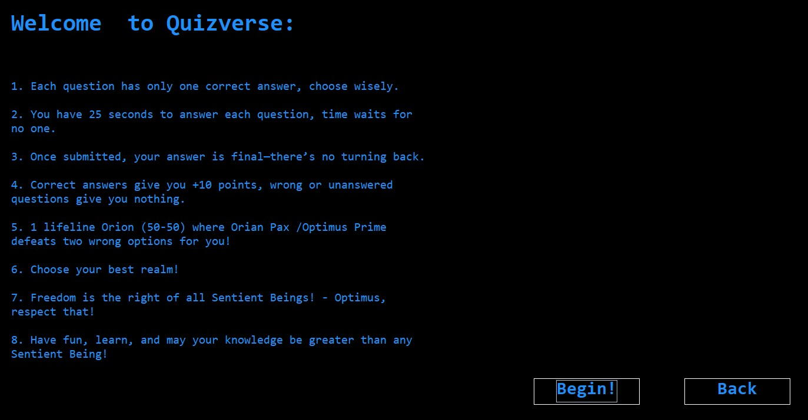
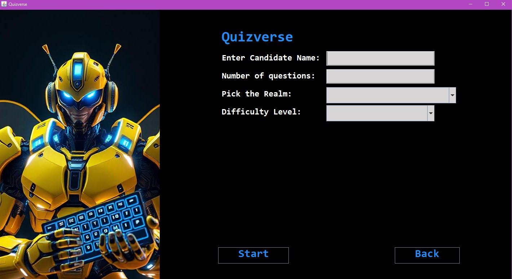
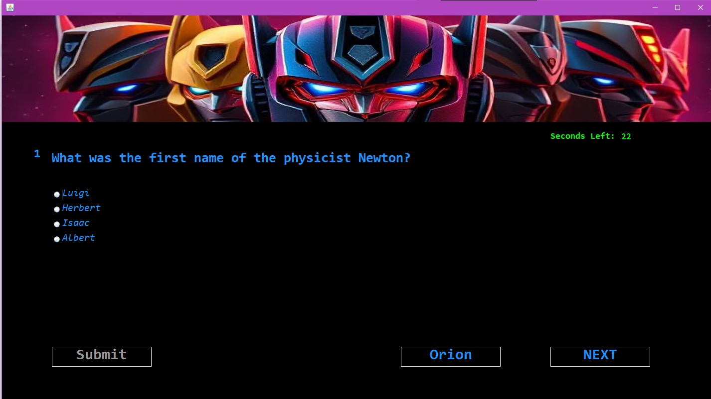
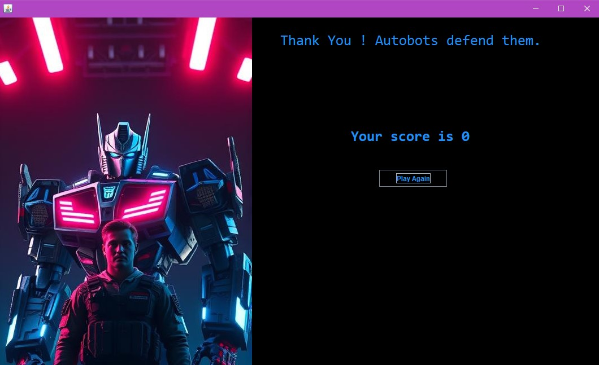

Quiz Application

This is a Java-based Quiz Application using Swing for the GUI. The application fetches trivia questions dynamically from The Trivia API and presents them in a multiple-choice format.

Requirements

JDK 21 (Ensure you have Java 21 installed)

JSON Library: json-20250107.jar (Required for parsing API responses)

Setup Instructions

Install JDK 21Download and install JDK 21 from Oracle's official website or use OpenJDK.

Download JSON LibraryDownload json-20250107.jar from Maven Repository and place it in your project's lib folder.

Compile and Run the Project

javac -cp ".;lib/json-20250107.jar" quiz/application/*.java
java -cp ".;lib/json-20250107.jar" quiz.application.Main

Features

Dynamic quiz questions fetched via The Trivia API

Java Swing-based GUI

Lifeline feature to remove incorrect options

Score calculation and result display

Screenshots

Below are screenshots of the application:

Notes

Ensure you have an active internet connection to fetch trivia questions.

Modify the API request parameters (difficulty, category, etc.) inside the Quiz class constructor.

License

This project is open-source and available for modification and use in educational or personal projects.